# Document-to-Speech Pipeline — Architecture Document (Simplified POC)

| | |
|---|---|
| **Hệ thống** | Document-to-Speech Pipeline (D2S) |
| **Version** | 1.0.0-POC |
| **Date** | 18/03/2026 |
| **Status** | Approved for POC Development |
| **Scope** | Personal use — single user, local machine |

---

## Mục lục

- [1. Executive Summary](#1-executive-summary)
- [2. Bối cảnh & Bài toán](#2-bối-cảnh--bài-toán)
- [3. Phạm vi hệ thống](#3-phạm-vi-hệ-thống)
- [4. Kiến trúc High-Level](#4-kiến-trúc-high-level)
  - [4.1. System Context](#41-system-context)
  - [4.2. Application Architecture](#42-application-architecture)
  - [4.3. Processing Pipeline](#43-processing-pipeline)
  - [4.4. LLM & TTS Configuration](#44-llm--tts-configuration)
  - [4.5. Data Flow tổng quan](#45-data-flow-tổng-quan)
- [5. Sequence Diagrams](#5-sequence-diagrams)
  - [5.1. Upload & Validate](#51-upload--validate)
  - [5.2. Parse, Chunk & Classify](#52-parse-chunk--classify)
  - [5.3. LLM Enrichment](#53-llm-enrichment)
  - [5.4. TTS Synthesis](#54-tts-synthesis)
  - [5.5. Audio Stitch & Delivery](#55-audio-stitch--delivery)
  - [5.6. Error Handling & Retry](#56-error-handling--retry)
- [6. Tech Stack](#6-tech-stack)
- [7. Quyết định kiến trúc (ADRs)](#7-quyết-định-kiến-trúc-adrs)
- [8. Yêu cầu phi chức năng](#8-yêu-cầu-phi-chức-năng)
- [9. API & UI Specification](#9-api--ui-specification)
- [10. Data Models](#10-data-models)
- [11. Caching Strategy](#11-caching-strategy)
- [12. Security Considerations](#12-security-considerations)
- [13. Budget ước tính](#13-budget-ước-tính)
- [14. Roadmap](#14-roadmap)
- [Phụ lục](#phụ-lục)

---

## 1. Executive Summary

Document-to-Speech Pipeline (D2S) là công cụ cá nhân tự động chuyển đổi tài liệu thành audio chất lượng cao. Hệ thống nhận input linh hoạt — upload file (DOCX/PDF) hoặc dán URL trực tiếp tới file — parse cấu trúc document, nhận diện bảng biểu và hình ảnh, sử dụng LLM để diễn giải nội dung phi văn bản thành đoạn tường thuật tự nhiên, sau đó tổng hợp giọng nói.

**Nguyên tắc thiết kế POC:**
- **Đơn giản nhất có thể** — 1 process Python duy nhất, không distributed system
- **Zero infrastructure** — không Docker, không Redis, không MinIO
- **UI nhanh** — Gradio (Python) thay vì React SPA
- **Chạy được ngay** — `pip install` + `python app.py` là xong

---

## 2. Bối cảnh & Bài toán

### 2.1. Problem Statement

Tài liệu (báo cáo, nghiên cứu, sách) nhiều nhưng thời gian đọc hạn chế. Cần chuyển sang dạng audio để nghe khi di chuyển, tập thể dục, hoặc nghỉ mắt.

### 2.2. Giải pháp

Automated pipeline: nhận file DOCX/PDF → xử lý thông minh mọi loại nội dung (text, bảng, ảnh) → xuất audio MP3.

### 2.3. Mục tiêu đo lường

| # | Mục tiêu | KPI |
|---|----------|-----|
| G1 | Tự động hóa 100% doc → audio | Không can thiệp thủ công |
| G2 | Chi phí gần bằng không | Edge TTS free + Groq free tier |
| G3 | Hỗ trợ đa dạng nội dung | Text, table, image |
| G4 | Xử lý chấp nhận được | < 15 phút cho tài liệu 50 trang |
| G5 | Chất lượng nghe được | Giọng tự nhiên, đúng ngữ cảnh |

---

## 3. Phạm vi hệ thống

### 3.1. In Scope (POC)

- **Input linh hoạt**: upload file DOCX/PDF **hoặc** dán URL trực tiếp tới file (auto-download)
- Tách file thành chunks thông minh theo heading
- Nhận diện nội dung: text, bảng, hình ảnh
- Gọi LLM diễn giải bảng/ảnh thành văn bản tường thuật
- Tổng hợp giọng nói (TTS) toàn bộ nội dung
- Xuất file MP3
- Web UI cơ bản: upload/URL input, progress, nghe, tải

### 3.2. Out of Scope (POC)

- Định dạng ngoài DOCX/PDF
- Web page scraping (HTML → text) — chỉ hỗ trợ URL trỏ trực tiếp tới file
- Đa ngôn ngữ nâng cao, clone voice
- Mobile app, user authentication, multi-tenancy
- Streaming audio realtime (nghe từng chunk khi đang xử lý)
- A/B testing giữa các model
- Distributed processing, auto-scaling
- Docker / container deployment

### 3.3. Giả định

- 1 người dùng duy nhất, chạy trên máy cá nhân
- Tài liệu có cấu trúc heading tương đối rõ
- Hình ảnh mang tính thông tin (chart, diagram)
- Mạng internet ổn định cho LLM API và Edge TTS
- Máy tối thiểu 8GB RAM, 4 CPU cores

---

## 4. Kiến trúc High-Level

### 4.1. System Context

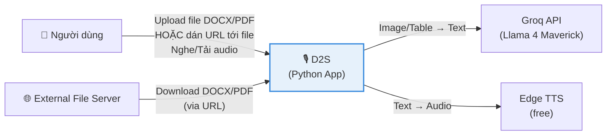

External interactions:
- **External File Server** — download file từ URL do user cung cấp (Google Drive, Dropbox share link, direct link...)
- **Groq API** — mô tả ảnh + diễn giải bảng (primary: Llama 4 Maverick, fallback: Llama 4 Scout — cùng provider)
- **Edge TTS** — TTS tiếng Việt miễn phí, chất lượng tốt

### 4.2. Application Architecture

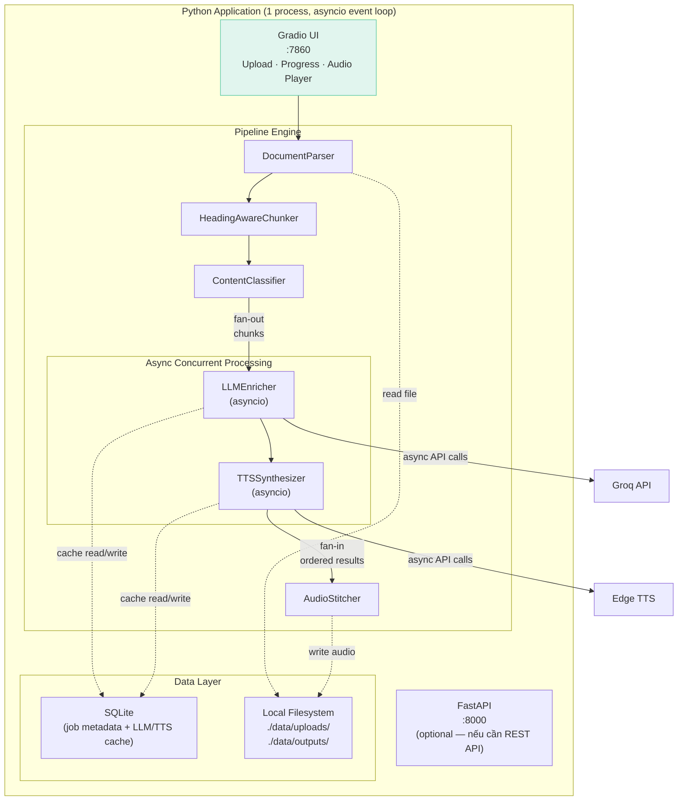

**Toàn bộ hệ thống là 1 Python process duy nhất:**

| Component | Công nghệ | Vai trò |
|-----------|-----------|---------|
| UI | Gradio 5 | Upload, progress bar, audio player, download |
| API (optional) | FastAPI + Uvicorn | REST endpoint nếu muốn gọi từ script/CLI |
| Pipeline | Python modules + asyncio | 6 stages: 3 sequential → enrich+TTS concurrent → stitch |
| Database | SQLite (via sqlite3) | Job metadata + cache |
| Storage | Local filesystem | Files upload + audio output |

**Không có:** Redis, MinIO, Celery, Docker, React, Node.js.

### 4.3. Processing Pipeline

Pipeline gồm 6 stages. Trong đó 3 stages đầu chạy tuần tự (cần output của stage trước), còn **Enrich + TTS xử lý song song nhiều chunks cùng lúc** qua `asyncio`:

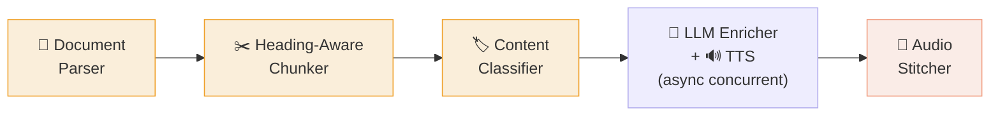

| Stage | Module | Input | Output | Processing | Mô tả |
|-------|--------|-------|--------|-----------|-------|
| 1 | `DocumentParser` | file_bytes | `elements[]` | Sequential | Parse cấu trúc DOCX/PDF. Trích xuất text, headings, tables, images |
| 2 | `HeadingAwareChunker` | `elements[]` | `chunks[]` | Sequential | Tách theo heading boundary (H1/H2/H3). Max 2500 từ/chunk |
| 3 | `ContentClassifier` | `chunks[]` | `chunks[]` + type | Sequential | Rule-based: gán TEXT, TABLE, IMAGE, MIXED |
| 4 | `LLMEnricher` | classified chunks | enriched text | **Concurrent** | TEXT → pass-through. TABLE → LLM narrate. IMAGE → LLM describe |
| 5 | `TTSSynthesizer` | enriched text | audio segments | **Concurrent** | Chuyển text thành audio qua Edge TTS |
| 6 | `AudioStitcher` | audio segments | final audio | Sequential | Concat, normalize, silence gaps, fade. Export MP3 |

#### Concurrent Processing Model

Sau khi classify xong, mỗi chunk được xử lý **độc lập** (enrich → TTS) qua `asyncio.gather`. Thứ tự đảm bảo nhờ `chunk.order` — dù chunk nào xong trước/sau, kết quả luôn được collect theo đúng order ban đầu.

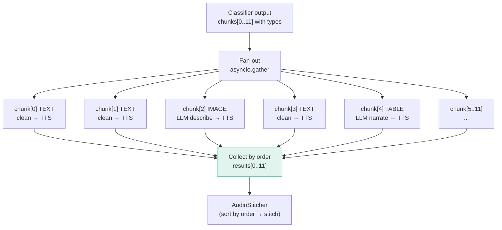

**Tại sao không cần Redis/Celery?**

`asyncio` là in-process concurrency — đủ mạnh cho I/O-bound tasks (gọi API, chờ response). Không cần distributed queue vì:
- 1 user, 1 job tại 1 thời điểm
- Bottleneck là network I/O (LLM API, TTS API), không phải CPU
- `asyncio.Semaphore` kiểm soát concurrency (tránh rate limit)
- `asyncio.gather` tự bảo toàn thứ tự kết quả

```python
# Minh họa core logic
async def process_chunk(chunk: Chunk, semaphore: asyncio.Semaphore) -> AudioSegment:
    """Enrich + TTS cho 1 chunk. Chạy concurrent với các chunks khác."""
    async with semaphore:
        # Phase 1: Enrich (rẽ nhánh theo type)
        if chunk.type == "TEXT":
            enriched = clean_for_tts(chunk.text)            # instant
        elif chunk.type == "IMAGE":
            enriched = await llm_describe_image(chunk.image) # ~3-5s
        elif chunk.type == "TABLE":
            enriched = await llm_narrate_table(chunk.table)  # ~3-5s
        elif chunk.type == "MIXED":
            enriched = await enrich_mixed(chunk)             # ~3-5s

        # Phase 2: TTS
        audio = await tts_synthesize(enriched)               # ~2-3s
        return AudioSegment(order=chunk.order, audio=audio)

async def run_pipeline(chunks: list[Chunk]) -> list[AudioSegment]:
    sem = asyncio.Semaphore(5)  # max 5 concurrent API calls

    # Fan-out: tất cả chunks chạy song song
    # Fan-in: gather trả kết quả ĐÚNG THỨ TỰ input
    results = await asyncio.gather(
        *[process_chunk(c, sem) for c in chunks]
    )
    # results[0] = chunk[0], results[1] = chunk[1], ... (guaranteed order)
    return results
```

**Concurrency controls:**

| Resource | Semaphore limit | Lý do |
|----------|----------------|-------|
| Groq API | 5 concurrent | Free tier: 30 RPM → 5 concurrent an toàn |
| Edge TTS | 10 concurrent | Free, không rate limit nghiêm ngặt |

**So sánh hiệu năng (12 chunks, 4 non-text):**

| Mode | Enrich time | TTS time | Total (enrich+TTS) |
|------|-------------|----------|---------------------|
| Sequential | ~16s (4 × 4s) | ~36s (12 × 3s) | ~52s |
| Concurrent (sem=5) | ~8s | ~9s | ~17s |
| **Speedup** | | | **~3x nhanh hơn** |

### 4.4. LLM & TTS Configuration

Không cần Provider Registry pattern phức tạp. Dùng simple config:

```python
# config.py
LLM_CONFIG = {
    "provider": "groq",
    "model": "meta-llama/llama-4-maverick-17b-128e-instruct",
    "fallback_model": "meta-llama/llama-4-scout-17b-16e-instruct",
    "max_tokens": 2048,
    "temperature": 0.3,
}

TTS_CONFIG = {
    "engine": "edge-tts",
    "voice": "vi-VN-HoaiMyNeural",
    "rate": "+0%",
    "volume": "+0%"
}

AUDIO_CONFIG = {
    "format": "mp3",
    "bitrate": "192k",
    "sample_rate": 44100,
    "channels": 1,               # mono
    "target_lufs": -16,
    "fade_in_ms": 500,
    "fade_out_ms": 1000,
    "gap_between_chunks_ms": 300,
    "gap_between_sections_ms": 800
}

CONCURRENCY_CONFIG = {
    "llm_semaphore": 5,          # max concurrent LLM calls (Groq free: 30 RPM)
    "tts_semaphore": 10,         # max concurrent TTS calls (Edge TTS: generous)
}

URL_DOWNLOAD_CONFIG = {
    "connect_timeout": 10,       # seconds — tránh treo khi server không phản hồi
    "download_timeout": 120,     # seconds — đủ cho file 200MB
    "max_redirects": 5,          # Google Drive, short URL thường redirect 2-3 lần
    "max_file_size": 200 * 1024 * 1024,  # 200MB — consistent với upload limit
    "user_agent": "D2S-Pipeline/1.0",
    "supported_content_types": [
        "application/pdf",
        "application/vnd.openxmlformats-officedocument.wordprocessingml.document",
        "application/octet-stream",  # Một số server trả generic type
    ],
}
```

**Thêm provider mới khi nào?** Khi POC đã validate xong và cần so sánh chất lượng giữa nhiều engine. Lúc đó refactor sang Registry pattern — có data thực tế để justify complexity.

### 4.5. Data Flow tổng quan

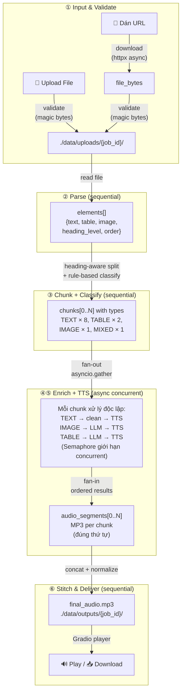

---

## 5. Sequence Diagrams

### 5.1. Upload & Validate

Hệ thống hỗ trợ **2 cách nhập input**: upload file trực tiếp hoặc dán URL tới file. Cả 2 đều hội tụ về cùng pipeline xử lý sau khi file được lưu local.

#### 5.1a. Upload File (Drag & Drop)

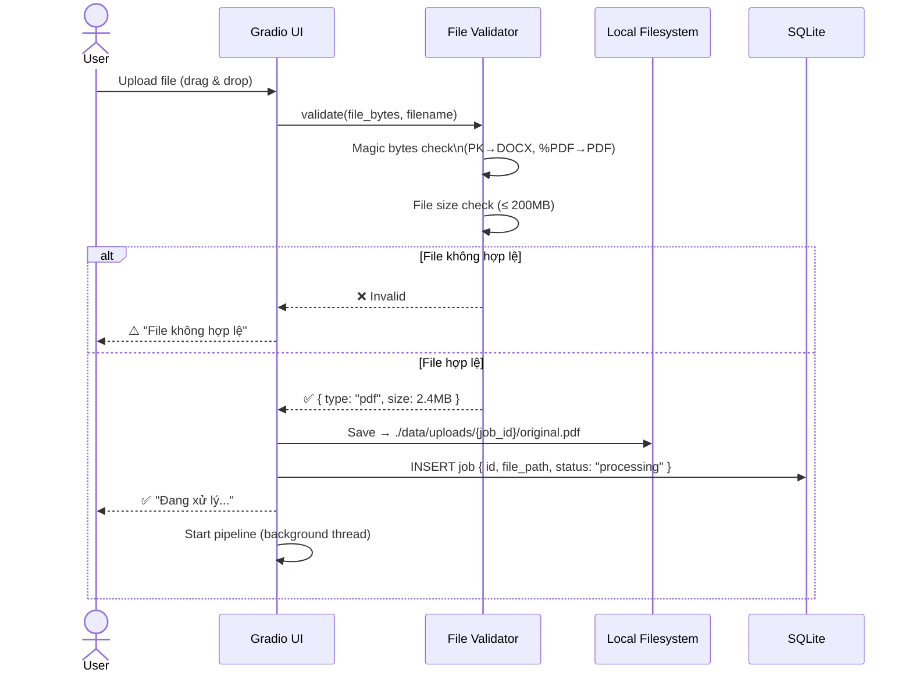

#### 5.1b. URL Input (Auto-Download)

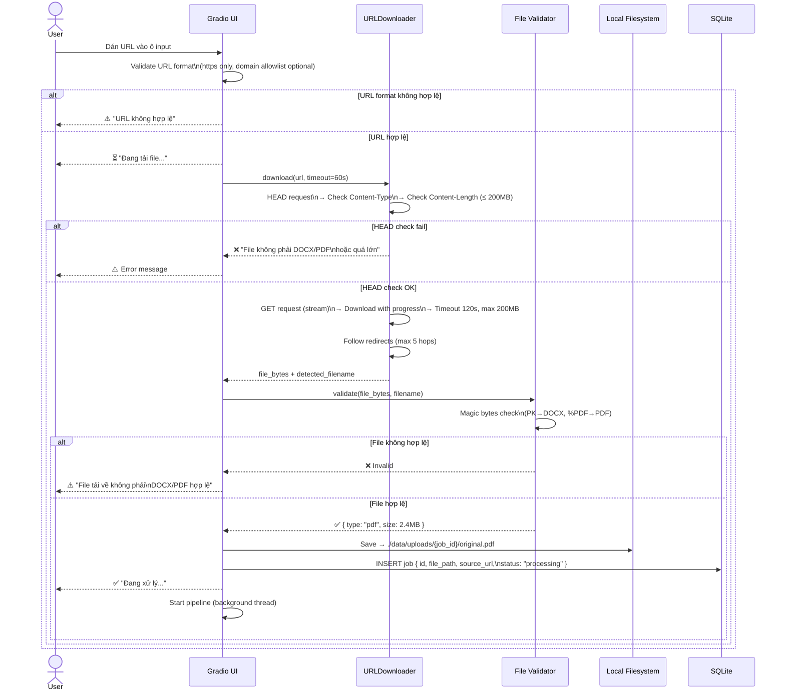

**URL Download — Chi tiết kỹ thuật:**

| Thông số | Giá trị | Lý do |
|----------|---------|-------|
| HTTP client | `httpx` (async) | Đã có trong dependency, hỗ trợ async + streaming |
| Timeout (connect) | 10s | Tránh treo khi server không phản hồi |
| Timeout (download) | 120s | Đủ cho file 200MB qua mạng trung bình |
| Max redirects | 5 | Xử lý short URL, CDN redirect |
| Max file size | 200MB | Consistent với upload limit |
| Supported protocols | HTTPS only | Bảo mật cơ bản, tránh MITM |
| User-Agent | `D2S-Pipeline/1.0` | Tránh bị block bởi CDN |

**Supported URL patterns:**

| Source | URL pattern | Ghi chú |
|--------|------------|---------|
| Direct link | `https://example.com/file.pdf` | Download trực tiếp |
| Google Drive | `https://drive.google.com/file/d/{id}/...` | Cần convert sang direct download link |
| Dropbox | `https://www.dropbox.com/s/{id}/file.pdf?dl=0` | Đổi `dl=0` → `dl=1` |
| OneDrive | `https://onedrive.live.com/...` | Convert sang direct download link |
| Generic CDN | Bất kỳ URL trả về DOCX/PDF | Dựa vào Content-Type + magic bytes |

**URL conversion logic (pseudo-code):**

```python
def normalize_download_url(url: str) -> str:
    """Convert sharing URLs thành direct download URLs."""
    parsed = urlparse(url)

    # Google Drive: /file/d/{id}/view → direct download
    if "drive.google.com" in parsed.netloc:
        file_id = extract_gdrive_id(url)
        return f"https://drive.google.com/uc?export=download&id={file_id}"

    # Dropbox: dl=0 → dl=1
    if "dropbox.com" in parsed.netloc:
        return url.replace("dl=0", "dl=1").replace("www.dropbox.com", "dl.dropboxusercontent.com")

    # OneDrive: convert to direct
    if "onedrive.live.com" in parsed.netloc or "1drv.ms" in parsed.netloc:
        return convert_onedrive_to_direct(url)

    # Default: dùng URL gốc
    return url
```

### 5.2. Parse, Chunk & Classify

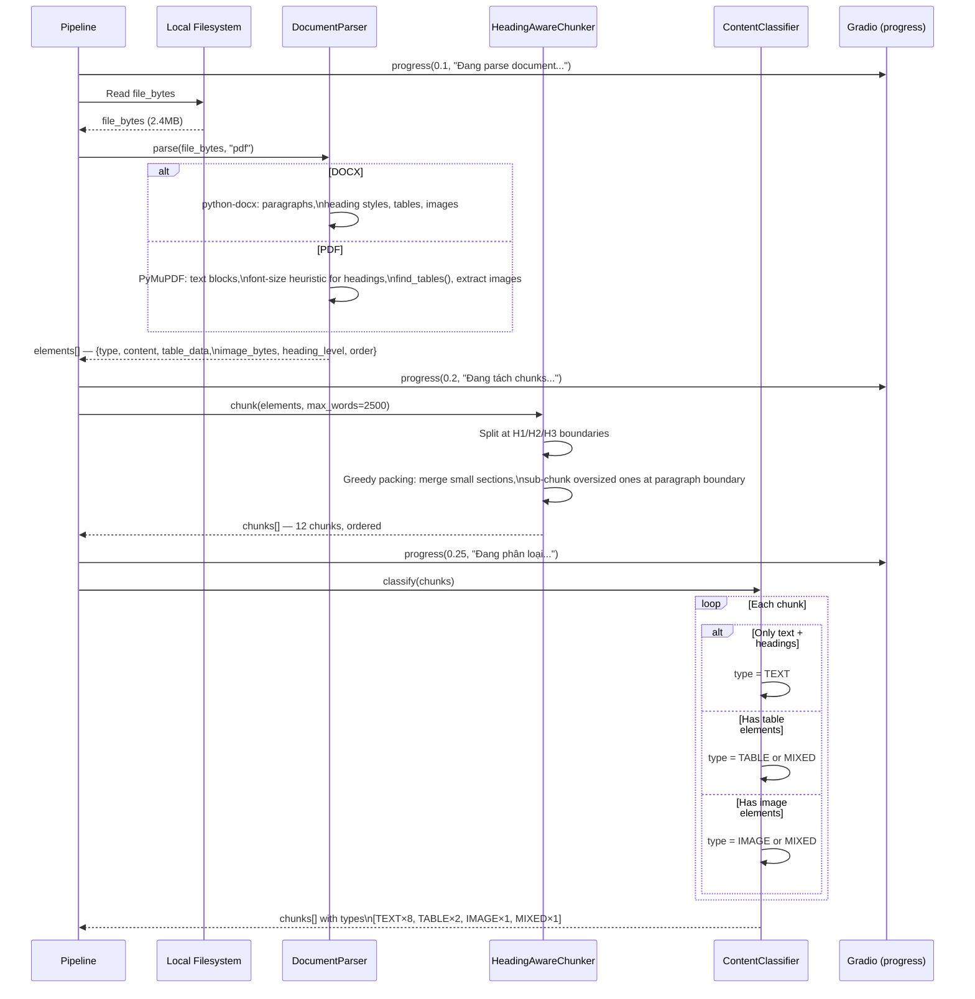

### 5.3. Enrich + TTS (Async Concurrent)

Sau khi classify, tất cả chunks được fan-out xử lý song song. Mỗi chunk đi qua pipeline riêng: **Enrich → TTS**. Kết quả được collect theo đúng thứ tự ban đầu.

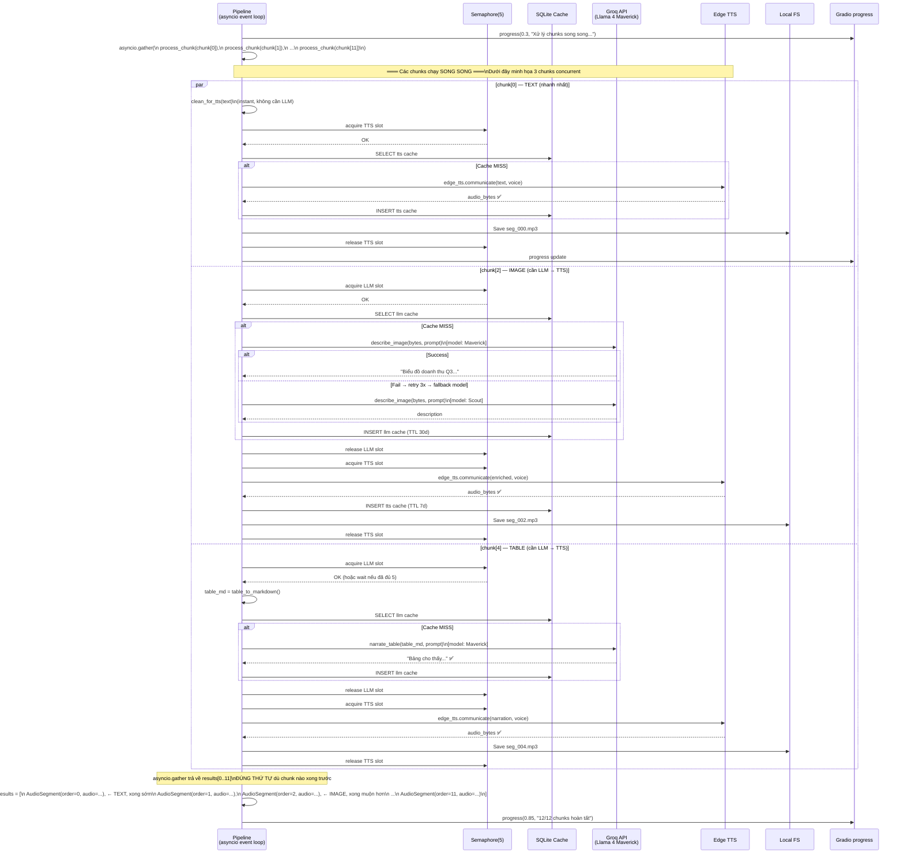

**Giải thích flow rẽ nhánh:**

```
chunks[0] TEXT  ──→ clean(instant) ──→ TTS ──→ audio ──┐
chunks[1] TEXT  ──→ clean(instant) ──→ TTS ──→ audio ──┤
chunks[2] IMAGE ──→ LLM(~4s) ──→ TTS ──→ audio ───────┤
chunks[3] TEXT  ──→ clean(instant) ──→ TTS ──→ audio ──┤
chunks[4] TABLE ──→ LLM(~4s) ──→ TTS ──→ audio ───────┤ → gather
chunks[5] TEXT  ──→ clean(instant) ──→ TTS ──→ audio ──┤   (order
chunks[6] TEXT  ──→ clean(instant) ──→ TTS ──→ audio ──┤   preserved)
chunks[7] TABLE ──→ LLM(~4s) ──→ TTS ──→ audio ───────┤
chunks[8] TEXT  ──→ clean(instant) ──→ TTS ──→ audio ──┤
chunks[9] TEXT  ──→ clean(instant) ──→ TTS ──→ audio ──┤
chunks[10] TEXT ──→ clean(instant) ──→ TTS ──→ audio ──┤
chunks[11] MIXED──→ LLM+clean ──→ TTS ──→ audio ──────┘
```

- TEXT chunks: skip LLM, chỉ clean text → TTS ngay (~3s total)
- IMAGE/TABLE chunks: LLM enrich (~4s) → TTS (~3s) = ~7s total
- Tất cả chạy song song, tổng thời gian ≈ thời gian chunk chậm nhất (~7-9s)
- Semaphore(5) đảm bảo không quá 5 API calls đồng thời → tránh rate limit

### 5.5. Audio Stitch & Delivery

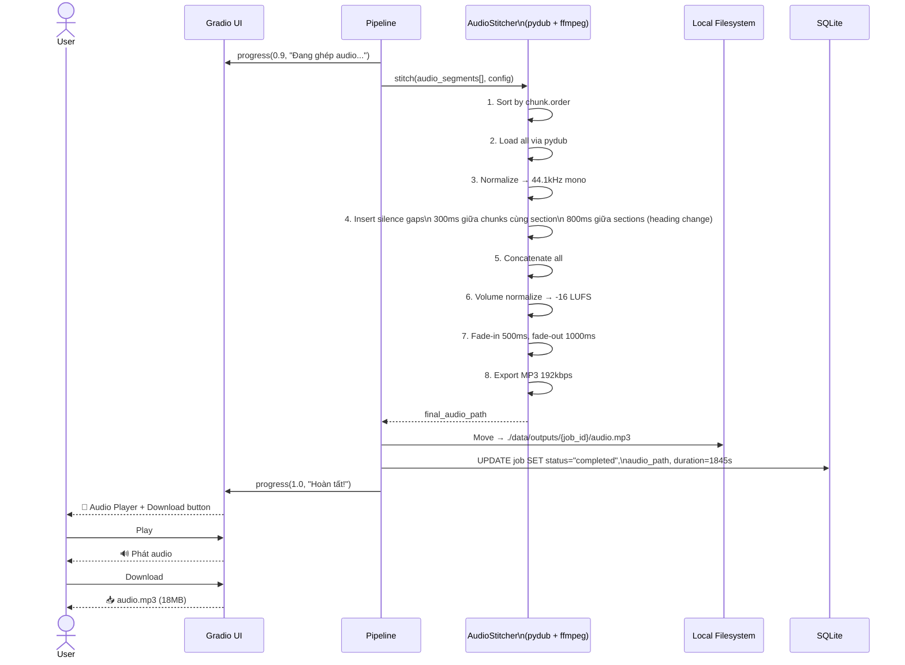

### 5.6. Error Handling & Retry

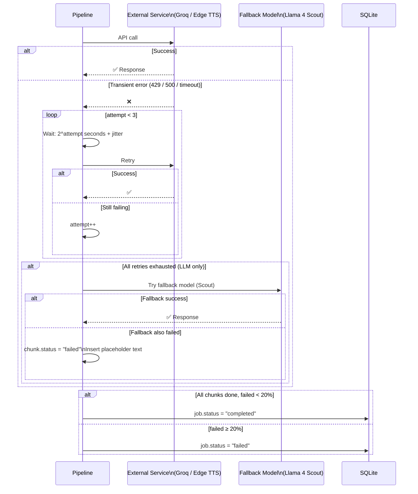

---

## 6. Tech Stack

### 6.1. Backend Core

| Component | Technology | Vai trò |
|-----------|-----------|---------|
| Language | Python 3.11+ | Runtime duy nhất |
| UI | Gradio 5 | Web UI: upload, progress, audio player |
| API (optional) | FastAPI + Uvicorn | REST endpoint cho CLI/script |
| Database | sqlite3 (built-in) | Job metadata + cache |
| Storage | Local filesystem | File uploads + audio outputs |
| Concurrency | asyncio + Semaphore | Concurrent chunk processing, rate limiting |

### 6.2. Document Processing

| Component | Technology | Vai trò |
|-----------|-----------|---------|
| DOCX Parser | python-docx 1.1 | Extract paragraphs, headings, tables, images |
| PDF Parser | PyMuPDF (fitz) 1.25 | Extract text blocks, images, tables |
| Image Processing | Pillow 11 | Resize images trước khi gửi LLM (max 1024px) |
| Audio Processing | pydub 0.25 + ffmpeg 6 | Stitch segments, normalize volume, export |

### 6.3. LLM Providers

| Provider | Model | Use Case | Cost | Vietnamese |
|----------|-------|----------|------|-----------|
| Groq | Llama 4 Maverick 17B | Image description + Table narration (primary) | Free tier: 30 RPM | ✅ |
| Groq | Llama 4 Scout 17B | Fallback cho cả image lẫn table | Free tier: 30 RPM | ✅ |

Chỉ cần 1 provider (Groq) với 2 models: primary (Maverick) + fallback (Scout). Cả hai đều nằm trong free tier — hoàn toàn miễn phí cho personal use.

### 6.4. TTS Engine

| Engine | Type | Quality | Cost | Vietnamese |
|--------|------|---------|------|-----------|
| Edge TTS | Cloud (free) | ⭐⭐⭐⭐ | $0 | ✅ 4 voices |

Default voice: `vi-VN-HoaiMyNeural` — giọng nữ, tự nhiên, rõ ràng.

> **Tại sao chỉ 1 TTS engine?** Edge TTS free, chất lượng tốt cho tiếng Việt, không rate limit khắt khe. Nếu cần so sánh chất lượng với OpenAI TTS hay ElevenLabs, thêm sau khi POC đã chạy ổn.

### 6.5. Dependency Matrix

| Package | Version | License | Purpose |
|---------|---------|---------|---------|
| Python | 3.11+ | PSF | Runtime |
| gradio | 5.x | Apache-2.0 | Web UI |
| fastapi | 0.115.x | MIT | Optional REST API |
| uvicorn | 0.34.x | BSD | ASGI server |
| python-docx | 1.1.x | MIT | DOCX parsing |
| PyMuPDF | 1.25.x | AGPL-3.0 | PDF parsing |
| Pillow | 11.x | HPND | Image processing |
| httpx | 0.28.x | BSD | Async HTTP (LLM calls) |
| edge-tts | 6.1.x | GPL-3.0 | Microsoft TTS |
| pydub | 0.25.x | MIT | Audio processing |
| ffmpeg | 6.x | LGPL | Audio codec (system dep) |
| groq | latest | Apache-2.0 | Groq API client |

---

## 7. Quyết định kiến trúc (ADRs)

### ADR-001: Asyncio Concurrent Pipeline (thay vì Celery + Redis)

**Context**: POC cho 1 user, xử lý 1 file tại 1 thời điểm. Celery + Redis thêm 2 services, config phức tạp, debug khó. Tuy nhiên, xử lý chunk tuần tự quá chậm (bottleneck ở I/O: gọi LLM API, TTS API).

**Decision**: Dùng `asyncio` event loop cho in-process concurrency. Mỗi chunk được xử lý độc lập (enrich → TTS) qua `asyncio.gather` + `Semaphore` kiểm soát rate limit. Thứ tự đảm bảo nhờ `gather` trả results theo đúng thứ tự input.

**Consequences**: Tăng tốc ~3x so với sequential. Không cần distributed queue. Không xử lý concurrent jobs (chấp nhận cho POC 1 user). 1 process duy nhất, debug dễ dàng.

### ADR-002: Local Filesystem (thay vì MinIO)

**Context**: MinIO là S3-compatible storage, cần thêm 1 container, config access key, presigned URL.

**Decision**: Lưu file trực tiếp vào `./data/`. Gradio serve file qua built-in file server.

**Consequences**: Không có presigned URL, không S3-compatible API. Chấp nhận cho POC local. Migration sang MinIO/S3 khi cần deploy cloud.

### ADR-003: Gradio UI (thay vì React SPA)

**Context**: React SPA cần riêng: Node.js, build pipeline, Dockerfile, WebSocket client. Ước tính 2-3 tuần dev.

**Decision**: Gradio — 1 file Python, có sẵn file upload, progress bar, audio player, download button.

**Consequences**: UI không custom được sâu, nhưng đủ cho POC. Chuyển sang React khi cần UI phức tạp hơn.

### ADR-004: SQLite Cache (thay vì Redis)

**Context**: Redis cần thêm 1 service cho caching. POC chỉ cần cache kết quả LLM và TTS.

**Decision**: Dùng SQLite table `cache` với columns (hash, result_type, result_data, expires_at). Khi query, check `expires_at > now()`.

**Consequences**: Chậm hơn Redis (~1ms vs ~0.1ms) nhưng hoàn toàn đủ cho 1 user. Zero infrastructure thêm.

### ADR-005: Heading-Aware Chunking

**Context**: Fixed-size chunking gây đứt gãy nội dung, người nghe mất ngữ cảnh.

**Decision**: Parse heading structure, tách chunk tại H1/H2/H3 boundary. Max 2500 từ/chunk ≈ 3 phút audio.

**Consequences**: Chunk size không đều nhưng đảm bảo mỗi chunk là đơn vị ngữ nghĩa hoàn chỉnh.

### ADR-006: Simple Config (thay vì Provider Registry Pattern)

**Context**: Provider Registry + Strategy Pattern phù hợp khi có nhiều user cần customize model selection. POC 1 user chỉ cần pick 1 provider.

**Decision**: Config dict trong `config.py`. Fallback logic là simple if/else.

**Consequences**: Thêm provider = sửa code (chấp nhận cho POC). Refactor sang Registry khi có > 3 providers cần dynamic switching.

---

## 8. Yêu cầu phi chức năng

| Attribute | POC Target | Ghi chú |
|-----------|-----------|---------|
| **Performance** | < 5 min cho 50 trang | Async concurrent chunks (Semaphore=5) |
| **Throughput** | 1 job tại 1 thời điểm | Đủ cho 1 user |
| **Availability** | Best-effort | Chạy khi cần, tắt khi không dùng |
| **Storage** | 10 GB local | Xóa thủ công khi đầy |
| **Security** | Không auth (local only) | Chỉ bind localhost |
| **Monitoring** | Print logs to console | Structured logging (Python logging) |
| **Max File Size** | 200 MB | Giới hạn hợp lý cho máy cá nhân |
| **Audio Format** | MP3 192kbps | Cố định cho đơn giản |

---

## 9. API & UI Specification

### 9.1. Gradio UI (Primary Interface)

```
┌──────────────────────────────────────────┐
│  📄 Document-to-Speech                   │
├──────────────────────────────────────────┤
│                                          │
│  ┌─ Input ─────────────────────┐         │
│  │                             │         │
│  │  [Tab: 📁 Upload File]               │
│  │  [Tab: 🔗 Dán URL   ]               │
│  │                             │         │
│  │  ── Tab Upload ──────────── │         │
│  │  ┌───────────────────────┐  │         │
│  │  │  📁 Upload DOCX/PDF   │  │         │
│  │  │  (drag & drop / browse)│  │         │
│  │  └───────────────────────┘  │         │
│  │                             │         │
│  │  ── Tab URL ─────────────── │         │
│  │  ┌───────────────────────┐  │         │
│  │  │ 🔗 https://drive.goo… │  │         │
│  │  └───────────────────────┘  │         │
│  │  Hỗ trợ: Direct link,      │         │
│  │  Google Drive, Dropbox,     │         │
│  │  OneDrive                   │         │
│  │                             │         │
│  └─────────────────────────────┘         │
│                                          │
│  Voice: [vi-VN-HoaiMyNeural ▾]          │
│                                          │
│  [🚀 Bắt đầu xử lý]                    │
│                                          │
│  ████████████░░░░░ 65% - TTS 8/12...    │
│                                          │
│  ┌─────────────────────────────┐         │
│  │ 🔊 ▶ ━━━━━━━●━━━━━ 18:32   │         │
│  │    🔉 ━━━━━━●━ Speed: 1.0x  │         │
│  └─────────────────────────────┘         │
│                                          │
│  [📥 Download MP3]                       │
│                                          │
│  📊 Stats: 12 chunks · 30:45 · 18MB     │
│           Cost: $0.05 · Engine: edge-tts │
│                                          │
│  ┌─ History ───────────────────┐         │
│  │ ✅ report.pdf    30:45  18MB│         │
│  │ 🔗 thesis.docx   45:12  27MB│        │
│  │ ⏳ manual.pdf    processing │         │
│  └─────────────────────────────┘         │
└──────────────────────────────────────────┘
```

### 9.2. REST API (Optional — cho CLI/automation)

| Method | Path | Request | Response | Mô tả |
|--------|------|---------|----------|-------|
| `POST` | `/api/upload` | `multipart/form-data` | `{ job_id, status }` | Upload file + start processing |
| `POST` | `/api/upload-url` | `{ "url": "https://..." }` | `{ job_id, status }` | Download từ URL + start processing |
| `GET` | `/api/jobs/{id}` | — | `{ job_id, status, progress }` | Job status |
| `GET` | `/api/jobs/{id}/audio` | — | `audio/mpeg` | Download audio file |
| `GET` | `/api/health` | — | `{ status: "ok" }` | Health check |

### 9.3. Voice Options

| Voice ID | Giới tính | Mô tả |
|----------|-----------|-------|
| `vi-VN-HoaiMyNeural` | Nữ | Giọng mặc định, tự nhiên |
| `vi-VN-NamMinhNeural` | Nam | Giọng nam |

---

## 10. Data Models

### 10.1. Job State Machine

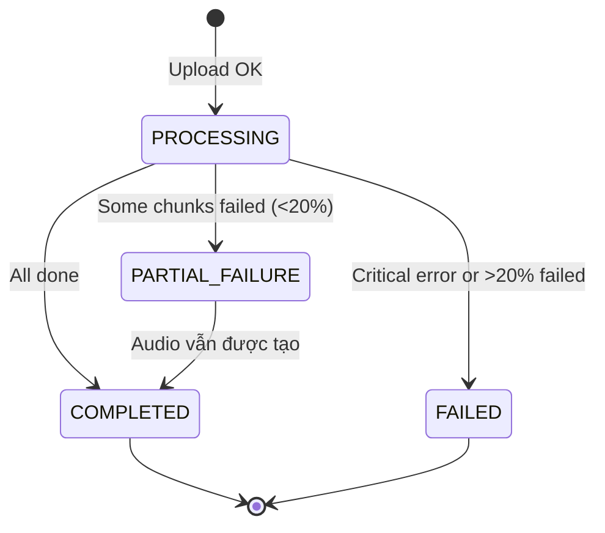

Đơn giản hóa từ 8 states xuống 4 states. Progress chi tiết thể hiện qua Gradio progress bar, không cần state machine phức tạp.

### 10.2. Database Schema (SQLite)

**jobs** table:

```sql
CREATE TABLE jobs (
    id              TEXT PRIMARY KEY,       -- UUID
    status          TEXT NOT NULL,           -- processing/completed/partial_failure/failed
    source_type     TEXT NOT NULL DEFAULT 'upload',  -- "upload" or "url"
    source_url      TEXT,                    -- URL gốc (NULL nếu upload trực tiếp)
    file_path       TEXT NOT NULL,           -- local path to uploaded/downloaded file
    file_type       TEXT NOT NULL,           -- "docx" or "pdf"
    file_size_bytes INTEGER,
    chunks_total    INTEGER DEFAULT 0,
    chunks_failed   INTEGER DEFAULT 0,
    audio_path      TEXT,                    -- local path to output audio
    audio_duration  REAL,                    -- seconds
    audio_size      INTEGER,                 -- bytes
    tts_voice       TEXT DEFAULT 'vi-VN-HoaiMyNeural',
    estimated_cost  REAL DEFAULT 0,          -- USD
    error_message   TEXT,
    created_at      TEXT DEFAULT (datetime('now')),
    completed_at    TEXT
);
```

**cache** table:

```sql
CREATE TABLE cache (
    hash        TEXT PRIMARY KEY,            -- sha256 of input
    type        TEXT NOT NULL,               -- "llm" or "tts"
    result      TEXT,                        -- text result (LLM) or file path (TTS)
    created_at  TEXT DEFAULT (datetime('now')),
    expires_at  TEXT NOT NULL                -- datetime for TTL
);

-- Auto-cleanup expired entries
-- Run periodically: DELETE FROM cache WHERE expires_at < datetime('now');
```

### 10.3. Storage Layout (Local Filesystem)

```
./data/
├── uploads/{job_id}/
│   └── original.{docx|pdf}
├── processing/{job_id}/
│   ├── seg_001.mp3
│   ├── seg_002.mp3
│   └── ...
├── outputs/{job_id}/
│   └── audio.mp3
└── cache/
    └── tts/
        ├── {hash1}.mp3
        └── {hash2}.mp3
```

---

## 11. Caching Strategy

| Layer | Key | Value | TTL | Storage |
|-------|-----|-------|-----|---------|
| LLM Cache | `sha256(prompt + content)` | response text | 30 days | SQLite `cache` table |
| TTS Cache | `sha256(text + voice)` | file path (.mp3) | 7 days | SQLite `cache` table + local file |

Cache hit scenarios:

| Scenario | Hit Rate | Impact |
|----------|----------|--------|
| Same document re-uploaded | ~95% | Skip gần toàn bộ pipeline |
| Documents có shared headers/footers | ~15–20% | Tiết kiệm TTS |
| Document hoàn toàn mới | 0% | Không tiết kiệm |

---

## 12. Security Considerations

| Concern | POC Approach |
|---------|-------------|
| Authentication | Không cần — bind `127.0.0.1` only |
| File validation | Extension + magic bytes check |
| URL input | HTTPS only, follow max 5 redirects, HEAD check trước khi download |
| SSRF prevention | Chỉ cho phép HTTPS public URLs, block private IP ranges (127.x, 10.x, 192.168.x) |
| API keys | `.env` file (gitignored) |
| Transport | HTTP localhost |
| Data at rest | Không mã hóa (local machine) |
| Input sanitization | File type + size limit (200MB), URL format validation |

---

## 13. Budget ước tính

### 13.1. Development Cost

| Hạng mục | Thời gian | Ghi chú |
|----------|-----------|---------|
| Pipeline backend (6 stages) | 5–7 ngày | Core logic |
| Gradio UI | 1–2 ngày | Upload, progress, player |
| Integration + testing | 2–3 ngày | End-to-end testing |
| **TOTAL** | **8–12 ngày** | 1 developer |

### 13.2. Operating Cost (Personal Use)

| Hạng mục | Chi phí | Ghi chú |
|----------|---------|---------|
| Groq API (Maverick + Scout) | $0 | Free tier: 30 RPM |
| Edge TTS | $0 | Free, không rate limit |
| Infrastructure | $0 | Chạy local |
| **TOTAL/document** | **$0** | Hoàn toàn miễn phí |

### 13.3. Risk Registry

| Risk | Xác suất | Impact | Mitigation |
|------|----------|--------|------------|
| Edge TTS policy change | Low | High | Thêm Kokoro local fallback (roadmap) |
| Groq free tier limit | Low | Medium | Fallback model Scout cùng provider, hoặc chuyển sang provider khác |
| LLM hallucination on images/tables | Medium | Medium | Prompt engineering, review output |
| Complex PDFs (scanned) | Medium | Medium | Out of scope, OCR in roadmap |

---

## 14. Roadmap

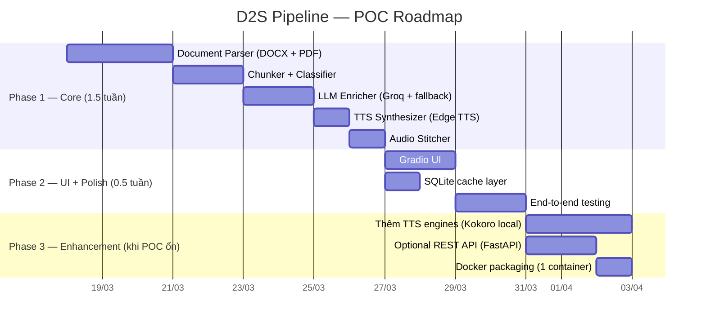

---

## Phụ lục

### A. Quick Start

```bash
# 1. Clone & setup
git clone <repo> && cd doc-to-speech
pip install -r requirements.txt

# 2. Cài ffmpeg (nếu chưa có)
# Windows: choco install ffmpeg
# macOS:   brew install ffmpeg
# Linux:   sudo apt install ffmpeg

# 3. Tạo .env
cp .env.example .env
# Thêm GROQ_API_KEY (bắt buộc)

# 4. Chạy
python app.py
# → Mở browser: http://localhost:7860
```

### B. Project Structure

```
doc-to-speech/
├── app.py                      # Entry point — Gradio UI + optional FastAPI
├── config.py                   # All configuration (LLM, TTS, audio, paths)
├── requirements.txt
├── .env.example
│
├── pipeline/
│   ├── __init__.py
│   ├── orchestrator.py         # Run 6 stages sequentially
│   ├── parser.py               # DocumentParser (DOCX + PDF)
│   ├── chunker.py              # HeadingAwareChunker
│   ├── classifier.py           # ContentClassifier (rule-based)
│   ├── enricher.py             # LLMEnricher (Groq + fallback model)
│   ├── synthesizer.py          # TTSSynthesizer (Edge TTS)
│   └── stitcher.py             # AudioStitcher (pydub)
│
├── llm/
│   ├── __init__.py
│   └── groq_client.py          # Groq API client (Maverick + Scout fallback)
│
├── utils/
│   ├── __init__.py
│   ├── validator.py            # File validation (magic bytes + URL format)
│   ├── downloader.py           # URL download (async httpx, streaming, URL normalization)
│   ├── text_cleaner.py         # Unicode normalize, expand abbreviations
│   ├── cache.py                # SQLite cache helper
│   └── retry.py                # Exponential backoff helper
│
├── db/
│   ├── __init__.py
│   └── models.py               # SQLite schema + CRUD
│
├── data/                       # Runtime data (gitignored)
│   ├── uploads/
│   ├── processing/
│   ├── outputs/
│   └── cache/
│
└── tests/
    ├── test_parser.py
    ├── test_chunker.py
    └── test_pipeline.py
```

### C. Environment Variables

```bash
# LLM (bắt buộc)
GROQ_API_KEY=                   # Groq API — free tier

# TTS
TTS_VOICE=vi-VN-HoaiMyNeural   # Default Vietnamese voice

# Pipeline
CHUNK_MAX_WORDS=2500
AUDIO_FORMAT=mp3
AUDIO_BITRATE=192k
CONCURRENT_LLM=5               # Max concurrent LLM API calls
CONCURRENT_TTS=10              # Max concurrent TTS API calls

# URL Download
URL_CONNECT_TIMEOUT=10         # seconds
URL_DOWNLOAD_TIMEOUT=120       # seconds
URL_MAX_REDIRECTS=5

# App
HOST=127.0.0.1
PORT=7860
DATA_DIR=./data
```

### D. So sánh kiến trúc cũ vs mới

| Tiêu chí | Kiến trúc cũ (v0) | Kiến trúc mới (v1-POC) |
|----------|-------------------|------------------------|
| Services | 6 containers | 1 Python process |
| UI | React SPA + WebSocket | Gradio (1 file Python) |
| Task queue | Celery + Redis | asyncio.gather + Semaphore |
| Chunk processing | Sequential (1 chunk tại 1 thời điểm) | Concurrent (fan-out/fan-in, order preserved) |
| Storage | MinIO (S3) | Local filesystem |
| Cache | Redis (3 layers) | SQLite table |
| LLM routing | Provider Registry + 5 strategies | Config dict + if/else |
| TTS engines | 4 (Edge, Kokoro, OpenAI, ElevenLabs) | 1 (Edge TTS) |
| LLM providers | 6 (Gemini, Grok, Claude, GPT, DeepSeek, Ollama) | 1 (Groq — Maverick + Scout fallback) |
| Dev time | 4–6 tuần | 1.5–2 tuần |
| RAM usage | ~4 GB | ~500 MB |
| Dependencies | ~20 packages + Docker | ~12 packages |
| Lines of code | ~5000+ | ~1500–2000 |

---

> **Document version**: 1.1.0 — 18/03/2026
> **Approach**: Simplified POC — validate core pipeline trước, scale sau
> **Next review**: Sau khi Phase 1 hoàn thành
