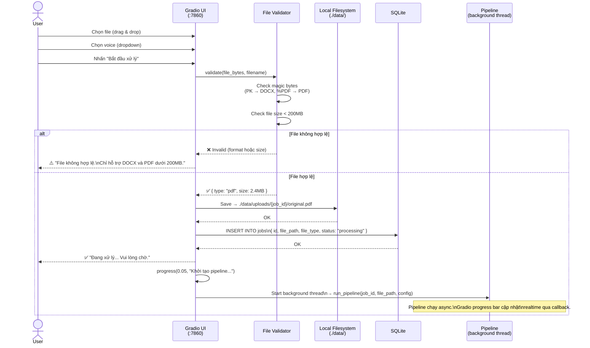
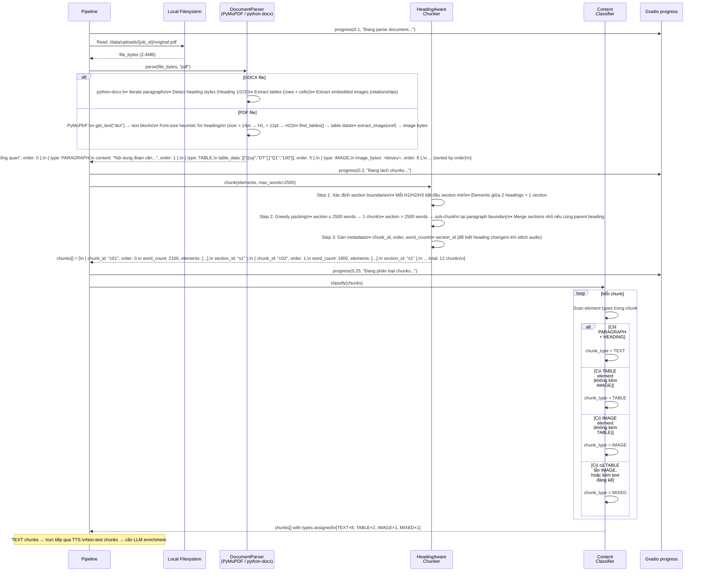
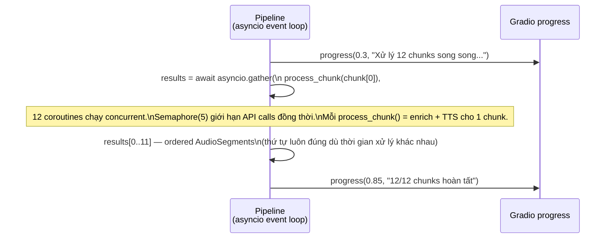
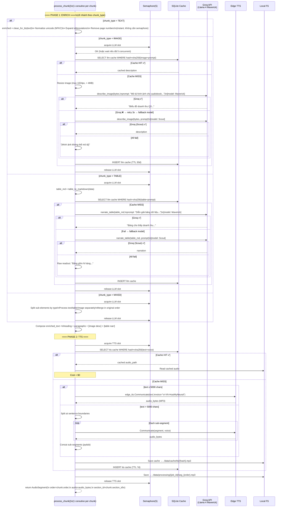
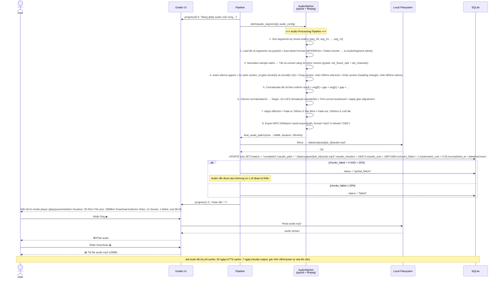
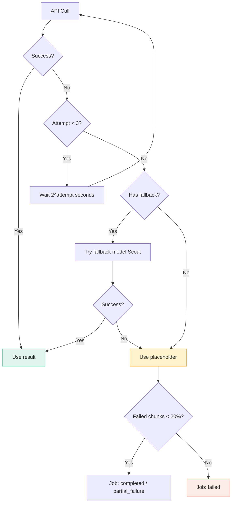

# Sequence Diagrams — Chi tiết luồng Data (Simplified POC)

> 5 diagrams cho 5 phases của pipeline.
> Kiến trúc đơn giản: 1 Python process, Gradio UI, SQLite, local filesystem.
> **Key design**: Enrich + TTS chạy **async concurrent** (asyncio.gather), không sequential.

---

## 1 / 5 — Upload & Validate

Luồng từ khi user upload file đến khi pipeline bắt đầu chạy.



---

## 2 / 5 — Parse, Chunk & Classify

Pipeline đọc file, parse cấu trúc, tách chunks theo heading, classify content type.



---

## 3 / 5 — Enrich + TTS (Async Concurrent)

Sau khi classify, tất cả chunks được **fan-out xử lý song song**. Mỗi chunk chạy pipeline riêng: Enrich → TTS. `asyncio.gather` đảm bảo kết quả trả về **đúng thứ tự** dù chunk nào xong trước.

### 3a. Tổng quan flow concurrent



**Timeline minh họa (12 chunks, 5 concurrent slots):**

```
t=0s   t=3s   t=6s   t=9s
│      │      │      │
├─ chunk[0]  TEXT:  clean→TTS ──→ ✅ done (3s)
├─ chunk[1]  TEXT:  clean→TTS ──→ ✅ done (3s)
├─ chunk[2]  IMAGE: LLM────→TTS ──→ ✅ done (7s)
├─ chunk[3]  TEXT:  clean→TTS ──→ ✅ done (3s)
├─ chunk[4]  TABLE: LLM────→TTS ──→ ✅ done (7s)
│  ── sem=5, slot freed ──
├─ chunk[5]  TEXT:  clean→TTS ──→ ✅ done (3s)
├─ chunk[6]  TEXT:  clean→TTS ──→ ✅ done (3s)
├─ chunk[7]  TABLE: LLM────→TTS ────→ ✅ done (7s)
├─ chunk[8]  TEXT:  clean→TTS ──→ ✅
├─ chunk[9]  TEXT:  clean→TTS ──→ ✅
├─ chunk[10] TEXT:  clean→TTS ──→ ✅
├─ chunk[11] MIXED: LLM+clean→TTS ──→ ✅
│                              │
Total: ~9s (thay vì ~52s sequential)
```

### 3b. Chi tiết process_chunk() — rẽ nhánh theo type



### 3c. Cơ chế bảo toàn thứ tự

```python
# asyncio.gather BẢO TOÀN THỨ TỰ input → output
results = await asyncio.gather(
    process_chunk(chunks[0]),   # → results[0], dù xong lúc t=3s
    process_chunk(chunks[1]),   # → results[1], dù xong lúc t=3s
    process_chunk(chunks[2]),   # → results[2], dù xong lúc t=7s (IMAGE, chậm hơn)
    process_chunk(chunks[3]),   # → results[3], dù xong lúc t=3s
    ...
)
# results[i] luôn = output của chunks[i]
# Không cần sort lại — thứ tự tự đảm bảo

# AudioStitcher nhận results[] đã đúng order
stitcher.stitch(results)  # seg_0 + gap + seg_1 + gap + seg_2 + ...
```

**Tại sao TEXT chunks không bị block bởi IMAGE/TABLE chunks?**

- `asyncio.gather` fire **tất cả** coroutines cùng lúc
- TEXT chunk: `clean_for_tts()` (instant) → TTS (~3s) → done (~3s total)
- IMAGE chunk: wait semaphore → LLM (~4s) → TTS (~3s) → done (~7s total)
- Chúng chạy **đồng thời**, TEXT chunk không chờ IMAGE chunk
- `gather` chỉ chờ **tất cả** xong rồi trả kết quả theo thứ tự

---

## 5 / 5 — Audio Stitch & Delivery

Gom segments, stitch thành file hoàn chỉnh, hiển thị audio player cho user.



---

## Bảng tổng hợp data transformation qua từng phase

| Phase | Input | Output | Processing | Xử lý bởi |
|-------|-------|--------|-----------|-----------|
| **1. Upload** | Raw file (DOCX/PDF) | Validated file trên disk | Sequential | File Validator |
| **2. Parse** | File binary | `elements[]` | Sequential | DocumentParser |
| **3. Chunk** | `elements[]` | `chunks[]` (max 2500 words, ordered) | Sequential | HeadingAwareChunker |
| **4. Classify** | `chunks[]` | `chunks[]` + `chunk_type` | Sequential | ContentClassifier |
| **5+6. Enrich → TTS** | Classified chunks | `audio_segments[]` (ordered) | **Concurrent** (asyncio.gather) | process_chunk() per chunk |
| **7. Stitch** | Audio segments | Final `audio.mp3` — 192kbps, -16 LUFS | Sequential | AudioStitcher + pydub |
| **8. Deliver** | Final audio path | Gradio audio player + download | Sequential | Gradio UI |

---

## Error handling summary



| Error type | Handling |
|-----------|----------|
| Groq timeout/429 | Retry 3x exponential backoff → fallback model Scout |
| Fallback model fail | Placeholder text cho LLM chunks |
| Edge TTS fail | Retry 3x → silence placeholder |
| Parse error | Job failed |
| File corrupt | Reject at validation |

---

> **Rendering**: Tất cả diagrams dùng Mermaid.js, tương thích GitHub, GitLab, VS Code (Markdown Preview Mermaid), và hầu hết Markdown viewers.
